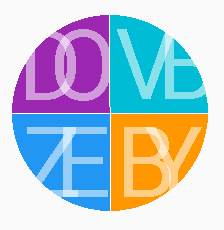

# Material Initials

An indicator that can be used as a background of person image or when it the is no image.
Possibilities include every application that utilises human resources (numbers in contact apps, messages in chat applications, etc...)

## Possibilities:

  **1.** Initials made from one pair of `String`:
  
   
       
  **2.** Initials made from two pairs of `String`:
  
   
       
  **3.** Initials made from three pairs of `String`:
  
   
       
  **4.** Initials made from four pairs of `String`:
  
   
       
  **5.** Three letter initials:
       
   
       
  **6.** Customisable alpha of letters:
  
   
  
  **7.** Black tinted letters:
    
   
       
  **8.** Rotated letters:
    
   

## Usage:

Add [`MaterialInitials`](./library/src/main/java/com/rzagorski/materialinitials/MaterialInitials.java) view in your .xml

    <com.rzagorski.materialinitials.MaterialInitials
        android:id="@+id/image"
        android:layout_width="match_parent"
        android:layout_height="wrap_content"/>

or use [`MaterialInitialsDrawable`](./library/src/main/java/com/rzagorski/materialinitials/MaterialInitialsDrawable.java) dynamically in your code:

    MaterialInitialsDrawable drawable = new MaterialInitialsDrawable();
    image.setImageDrawable(drawable);
    
## Conifguration

There are three possible ways to control each aspect of drawing:

  **1.** Use attributes in `.xml` layout
  
  **2.** Use methods of [`MaterialInitials`](./library/src/main/java/com/rzagorski/materialinitials/MaterialInitials.java) to control view
  
  **3.** Use method of [`MaterialInitialsDrawable`](./library/src/main/java/com/rzagorski/materialinitials/MaterialInitialsDrawable.java) to control `Drawable` directly.
  
### Options:

  **1. Initials** 
         Initials are composed of beginning letters of words passed to it. Each `String` must contain at least one word and at most 3 words.
      
   <table>
     <tr>
       <th>
            <b>Layout</b>
       </th>
       <th>
            <b>View</b>
       </th>
       <th>
            <b>Drawable</b>
       </th>
     </tr>
     <tr>
       <td>
            
`com.rzagorski.materialinitials.MaterialInitials`

            
&emsp;&emsp;`app:mi_texts="@array/string_array"/>`

       </td>
       <td>
            
`String[] values;`

            
`miView.setTexts(values);`

       </td>
       <td>
            
`String[] values`

            
`miDrawable.setTexts(values);`

       </td>
     </tr>
   </table>
   
  **2. Background colors** 
           Background colors must be the same size as texts size. The first initials will be drawn with first color background. The second initials
           will be drawn with second color background, etc. 
           If colors are not set, the background color is taken randomly from the set of 
           <a href="https://material.google.com/style/color.html#color-color-palette">500 material colors</a>
        
  <table>
     <tr>
       <th><b>Layout</b></th>
       <th><b>View</b></th>
       <th><b>Drawable</b></th>
     </tr>
     <tr>
       <td>
          
`com.rzagorski.materialinitials.MaterialInitials`

          
&emsp;&emsp;`app:mi_background_colors="@array/color_array"/>`

       </td>
       <td>
          
`int[] colors;`

`miView.setBackgroundColors(colors);`

       </td>
       <td>
          
`int[] colors;`

`miDrawable.setBackgroundColors(colors);`

       </td>
     </tr>
  </table>
  
  **3. Text color** 
           This parameter specifies the rgb channels of a color used to draw initials. Must be between 0 and 255.
        
  <table>
     <tr>
       <th><b>Layout</b></th>
       <th><b>View</b></th>
       <th><b>Drawable</b></th>
     </tr>
     <tr>
       <td>
          
`com.rzagorski.materialinitials.MaterialInitials`

          
&emsp;&emsp;`app:mi_text_color="@color/color"/>`

       </td>
       <td>
          
`int color;`

`miView.setTextColor(color);`

       </td>
       <td>
          
`int color;`

`miDrawable.setTextColor(color);`

       </td>
     </tr>
  </table>
  
  **4. Text alpha** 
           This parameter specifies the alpha channel of a color used to draw initials. Must be between 0 and 255.
        
  <table>
     <tr>
       <th><b>Layout</b></th>
       <th><b>View</b></th>
       <th><b>Drawable</b></th>
     </tr>
     <tr>
       <td>
          
`com.rzagorski.materialinitials.MaterialInitials`

          
&emsp;&emsp;`app:mi_textAlpha="@integer/alpha"/>`

       </td>
       <td>
          
`int alpha;`

`miView.setTextAlpha(alpha);`

       </td>
       <td>
          
`int alpha;`

`miDrawable.setTextAlpha(alpha);`

       </td>
     </tr>
  </table>
  
  **5. Text rotation** 
           This parameter specifies the rotation of initials in clockwise direction. Must be between 0 and 360 modulo.
        
  <table>
     <tr>
       <th><b>Layout</b></th>
       <th><b>View</b></th>
       <th><b>Drawable</b></th>
     </tr>
     <tr>
       <td>
          
`com.rzagorski.materialinitials.MaterialInitials`

          
&emsp;&emsp;`app:mi_rotation="@integer/rotation/>"`

       </td>
       <td>
          
`int rotation;`

`miView.setTextRotation(rotation);`

       </td>
       <td>
          
`int rotation;`

`miDrawable.setTextRotation(rotation);`

       </td>
     </tr>
  </table>